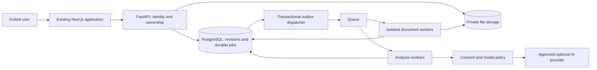

# Architecture and transition specification

**Scope update — 2026-10-02:** Local installation is the current default. Hosted accounts, invitation limits, managed infrastructure and release operations below describe a conditional future hosted profile, not local-run prerequisites or execution approval. Reconcile the implementation sequence before starting those tasks. See [decisions](DECISIONS_AND_APPROVALS.md#local-use-and-full-documentation-alignment--2026-10-02); preserve existing local behavior.

Target specification, 2026-09-30. Existing implementation is described in [Project Map](PROJECT_MAP.md). This file does not claim these services exist. Provider/tool selection is gated by GL-BASE-003 and [approvals](DECISIONS_AND_APPROVALS.md).

## Boundaries and reuse

Keep `apps/frontend` and `apps/backend`. Add domain modules inside the backend before considering extra packages. A worker process can import the same domain implementation without exposing parser/model code through HTTP handlers. Extract a shared package only when two real consumers require it. Do not create the source plans' entire illustrative directory tree.

| Domain | Owns | Existing integration seam | Must not own |
|---|---|---|---|
| Identity/policy | Session verification, account/role context, invitations | API middleware/dependencies and frontend account shell | Resume scoring or provider credentials in browser |
| Resume lifecycle | Revisions, ownership, storage manifests, retention, export | Database facade, resume routers, builder | Arbitrary remote network fetch |
| Document processing | Validation, scanning, extraction, conversion, rendering, OCR | Parser services, isolated worker | Provider keys or permission decisions |
| Analysis | Features, rules, evidence, contextual scoring | New pure analyzers; reuse existing semantic helpers where valid | Mutating source documents |
| Orchestration | Durable jobs, stages, cancellation, progress | New persisted job/outbox module | In-process locks as sole distributed authority |
| AI policy | Approved routes, minimization, budgets, structured output | Existing LiteLLM/budget/prompt modules | Unconstrained tools or granting access |
| Reference intelligence | Intake, review, aggregate snapshots, removal | Restricted new module | Exposure of raw reference files to candidates |
| Presentation | Report, canvas, editor, tracker, print | Existing components/client/design tokens | Privileged secrets or sole access enforcement |

The drawing denotes target responsibilities, not specific purchased products. Background processing has separate CPU/document and network/provider responsibilities. No GPU is required for the baseline. No Kubernetes, dedicated vector database, or microservice split by default.

## Transition order

1. Preserve a verified source recovery point and baseline behavior. Establish reproducible isolated tooling and synthetic fixtures.
2. Define and approve account contracts. Introduce identity and application-level ownership in local development. Early M1 ownership may use additive SQLite fields under G-DATA so existing workflows remain testable; it is not a hosted release. Apply the same ownership model to PostgreSQL in M2.
3. Introduce PostgreSQL through the existing repository/facade seam, preserving preview replay, master limits, atomic tracker writes and processing claims. Move schema changes out of implicit startup mutation into reviewed changes. No customer import needed under C-02; preserve the old source and document optional legacy handling instead of deleting it.
4. Add private file storage, durable jobs, retention and deletion. Keep all testing synthetic until full isolation and privacy acceptance passes.
5. Build one PDF-to-finding-to-feedback slice. Broaden extraction and rules only after that integration works.
6. Add full report, matching and safe optional assistance. Retest existing editing/export/attachments with account protection.
7. Complete release evidence and hosted approvals. Add corpus later; do not attach unreviewed references to beta reports.

## Transaction and concurrency rules

Store request intent and its outbox event in one database transaction. A dispatcher sends work and records delivery; duplicate sends are expected. Worker claims use database-backed leases and fencing tokens. Stage artifact commits require a valid lease, matching revision and non-deleted resource. Retrying a completed stage returns its existing artifact reference, not a second charge/result.

Queue messages contain IDs/version/context references, not resume text or signed URLs. Permissions are checked when work is enqueued and when an artifact is fetched/committed. Workers cannot accept an arbitrary user ID from document content. Scoped service identities are not interactive admin sessions.

Use retry budgets per stage and end-to-end deadlines; distinguish generation retry from confirmation replay. Persist partial stage success with explicit incomplete status. Progress is derived from durable state, not timers. Analysis workers cannot mutate a resume to satisfy a finding.

## Artifact and analysis versioning

An edited resume creates a new immutable revision for analysis. Runs bind document revision, job-description revision, profile, privacy policy, parser/IR/rule/semantic/embedding/prompt/model versions and optional cohort snapshot. Unknown external model revision is labelled unknown/provider-alias; do not promise bit-for-bit replay from an unpinned provider.

Account-scoped hashes permit reuse only within authorized ownership. Reuse key includes extraction configuration and all relevant versions. Signed access URLs are created on demand and never treated as permanent artifact identities. Retention/consent checks override reuse eligibility.

Incremental reanalysis is allowed only for analyzers whose declared inputs are unchanged. Pagination/font/layout changes invalidate geometry downstream. Prefer correct full reanalysis over stale pins or claims of “only changed sections” with no dependency proof.

## Client and export integration

Keep the shared API client and typed adapters. Generate/validate contract types after server schema approval; do not maintain divergent hand-written wire definitions. Preserve operation-owner cancellation and preview-confirmation replay semantics.

Report route additions sit beside existing routes, using existing design tokens. New account gates cover both default and print layouts. Workers render an authorized immutable snapshot through a narrowly scoped, short-lived internal mechanism; never exempt all print paths from authentication or put a reusable bearer token in a public URL.

## Decision gates and compatibility

Specific auth, storage, queue, parser/OCR, observability and hosting products are not yet approved. GL-BASE-003 must publish selected versions and tested compatibility before dependent tasks become READY. This is a deliberate decision task, not permission for implementers to choose ad hoc.

Proposed structural tooling: retain SQLAlchemy; evaluate Alembic for versioned database changes. Review parser licenses, native binaries, supported platforms and maintenance before adoption. No library name in an original plan is an installation instruction.

Preserve public routes and existing request semantics until a reviewed compatibility change covers every caller. Treat the current global reset, arbitrary provider URL settings and browser draft keys as explicit hosted-transition risks. Read [Security](SECURITY.md), [Contracts](CONTRACTS.md), and [Data and Privacy](DATA_AND_PRIVACY.md) together before changes.
